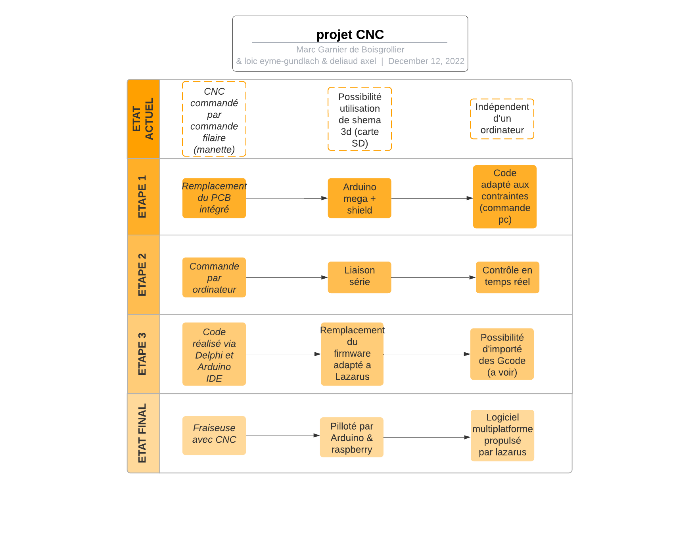
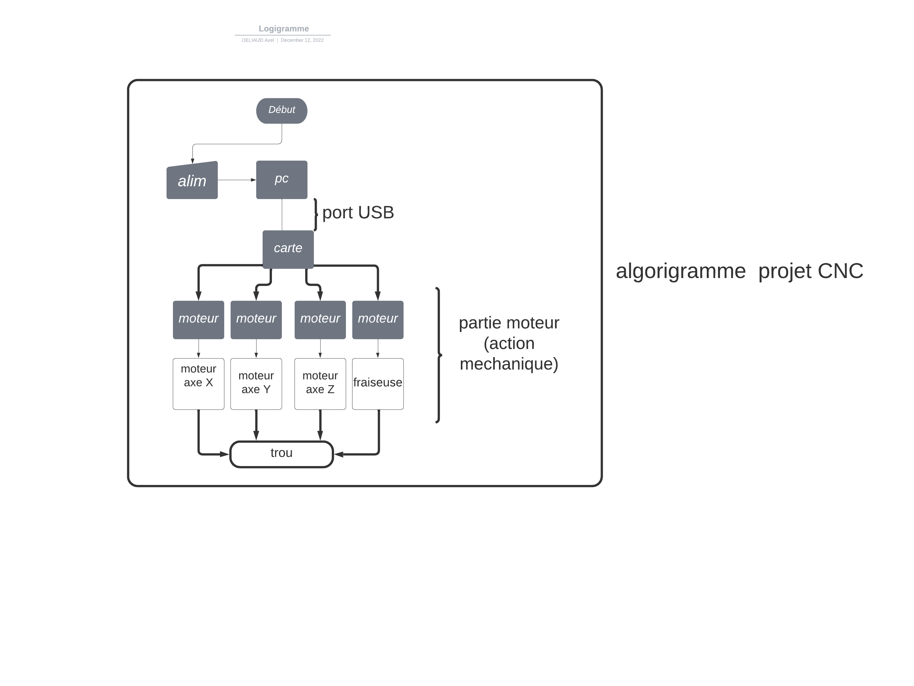

objectif : 
 	
Nous devons réaliser le programme de commande d’une fraiseuse avec CNC dans le but de remplacer la carte de commande d’origine.

Pour rappel, une fraiseuse est une machine-outil utilisée pour usiner tous types de pièces mécaniques, par enlèvement de matière à partir de blocs ou parfois d'ébauches estampées ou moulées, à l'aide d'un outil coupant nommé fraise.
La CNC signifie seulement "computer numerical control" soit contrôle numérique par ordinateur.
Pour cela, nous allons remplacer la carte d’origine par une carte arduino équipée d’un shield relié à des pilotes pour moteurs pas-à-pas qui sont sur la CNC d’origine.
Nous allons donc coder une interface grâce au logiciel Delphi qui nous permettra de contrôler notre CNC.
Notre application nous permettra entre autres d'importer un shema 3D simple, de contrôler la fraiseuse sur les différents axes, choisir de l'alimenter, ainsi que d'usiner.
La carte est dépendente de l'interface logicielle pour fonctionner, cependant, on utilisera un ordinateur embarqué, de type raspberry, qui sera intégré à notre fraiseuse.

